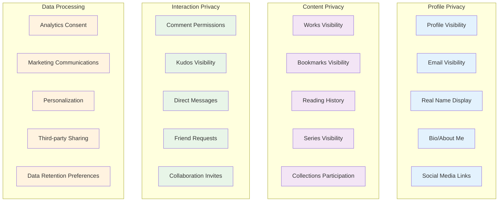
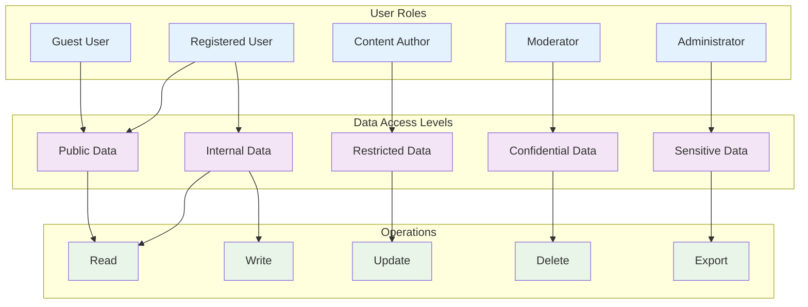
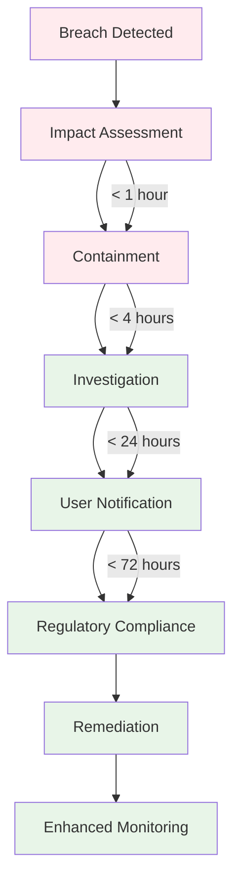

# Nuclear AO3 Privacy Controls & Data Protection

**Document Version:** 1.0.0  
**Last Updated:** October 8, 2025  
**Classification:** Public Documentation  

## 🛡️ **Privacy-First Architecture**

Nuclear AO3 implements privacy by design, ensuring user data protection is built into every system component rather than added as an afterthought.

### **Core Privacy Principles**

1. **Data Minimization**: Collect only what's necessary
2. **Purpose Limitation**: Use data only for stated purposes
3. **Storage Limitation**: Keep data only as long as needed
4. **Transparency**: Clear information about data practices
5. **User Control**: Granular privacy settings
6. **Security**: Strong protection measures
7. **Accountability**: Audit trails and compliance monitoring

---

## 🔒 **Granular Privacy Settings**

### **User Privacy Control Matrix**



### **Privacy Setting Levels**

| Setting | Public | Registered Users | Friends Only | Private |
|---------|--------|------------------|--------------|---------|
| **Profile** | ✅ | ✅ | ✅ | ✅ |
| **Works List** | ✅ | ✅ | ✅ | ✅ |
| **Bookmarks** | ✅ | ✅ | ✅ | ✅ |
| **Reading History** | ❌ | ✅ | ✅ | ✅ |
| **Email Address** | ❌ | ✅ | ✅ | ✅ |
| **Real Name** | ❌ | ❌ | ✅ | ✅ |
| **Activity Feed** | ✅ | ✅ | ✅ | ✅ |
| **Comment History** | ✅ | ✅ | ✅ | ✅ |

---

## 🗂️ **Data Classification & Protection**

### **Data Categories**

```go
type DataClassification string

const (
    // Public data - no privacy restrictions
    DataPublic DataClassification = "public"
    
    // Internal data - visible to registered users
    DataInternal DataClassification = "internal"
    
    // Restricted data - requires explicit permission
    DataRestricted DataClassification = "restricted"
    
    // Confidential data - user private information
    DataConfidential DataClassification = "confidential"
    
    // Sensitive data - requires special handling
    DataSensitive DataClassification = "sensitive"
)

type UserData struct {
    // Public Information
    Username        string `privacy:"public" retention:"permanent"`
    DisplayName     string `privacy:"public" retention:"permanent"`
    Bio            string `privacy:"configurable" retention:"user_controlled"`
    
    // Internal Information
    Email          string `privacy:"confidential" retention:"account_lifetime"`
    JoinDate       time.Time `privacy:"internal" retention:"permanent"`
    LastActivity   time.Time `privacy:"internal" retention:"90_days"`
    
    // Restricted Information
    RealName       string `privacy:"restricted" retention:"user_controlled"`
    Location       string `privacy:"restricted" retention:"user_controlled"`
    DateOfBirth    time.Time `privacy:"restricted" retention:"verification_only"`
    
    // Sensitive Information
    IPAddresses    []string `privacy:"sensitive" retention:"6_months"`
    DeviceFingerprints []string `privacy:"sensitive" retention:"30_days"`
    LoginHistory   []LoginEvent `privacy:"sensitive" retention:"1_year"`
}
```

### **Data Protection Mapping**

| Data Type | Privacy Level | Encryption | Access Controls | Retention |
|-----------|---------------|------------|-----------------|-----------|
| **Username** | Public | Transit only | Public API | Permanent |
| **Email** | Confidential | At rest + transit | User + admin | Account lifetime |
| **Works Content** | Configurable | Transit only | User settings | User controlled |
| **Reading History** | Restricted | At rest + transit | User only | 90 days default |
| **IP Addresses** | Sensitive | At rest + transit | Security team | 6 months |
| **Payment Info** | Sensitive | PCI-compliant | Payment processor | Legal minimum |

---

## 🔐 **Privacy Implementation**

### **Privacy Setting Storage**

```sql
-- User privacy preferences table
CREATE TABLE user_privacy_settings (
    user_id UUID PRIMARY KEY REFERENCES users(id),
    
    -- Profile visibility settings
    profile_visibility visibility_level DEFAULT 'registered_users',
    email_visibility visibility_level DEFAULT 'private',
    real_name_visibility visibility_level DEFAULT 'private',
    
    -- Content visibility settings
    works_visibility visibility_level DEFAULT 'public',
    bookmarks_visibility visibility_level DEFAULT 'registered_users',
    reading_history_visibility visibility_level DEFAULT 'private',
    
    -- Interaction settings
    allow_guest_comments BOOLEAN DEFAULT true,
    allow_guest_kudos BOOLEAN DEFAULT true,
    allow_direct_messages BOOLEAN DEFAULT true,
    
    -- Data processing consent
    analytics_consent BOOLEAN DEFAULT false,
    marketing_consent BOOLEAN DEFAULT false,
    personalization_consent BOOLEAN DEFAULT true,
    
    -- Consent metadata
    consent_date TIMESTAMP DEFAULT CURRENT_TIMESTAMP,
    consent_ip_address INET,
    consent_user_agent TEXT,
    
    -- Audit fields
    created_at TIMESTAMP DEFAULT CURRENT_TIMESTAMP,
    updated_at TIMESTAMP DEFAULT CURRENT_TIMESTAMP
);

-- Enum for visibility levels
CREATE TYPE visibility_level AS ENUM (
    'public',
    'registered_users', 
    'friends_only',
    'private'
);
```

### **Privacy Middleware**

```go
// PrivacyMiddleware enforces user privacy settings
func PrivacyMiddleware() gin.HandlerFunc {
    return func(c *gin.Context) {
        userID := getUserIDFromContext(c)
        targetUserID := c.Param("user_id")
        
        // Skip privacy checks for user accessing their own data
        if userID == targetUserID {
            c.Next()
            return
        }
        
        // Get privacy settings for target user
        privacySettings, err := getPrivacySettings(targetUserID)
        if err != nil {
            c.JSON(http.StatusInternalServerError, gin.H{"error": "Privacy check failed"})
            c.Abort()
            return
        }
        
        // Check access permissions
        if !hasAccess(userID, targetUserID, privacySettings, c.Request.URL.Path) {
            c.JSON(http.StatusForbidden, gin.H{"error": "Access denied"})
            c.Abort()
            return
        }
        
        // Add privacy context for response filtering
        c.Set("privacy_settings", privacySettings)
        c.Set("requester_user_id", userID)
        
        c.Next()
    }
}

// Response filtering based on privacy settings
func FilterResponseByPrivacy(data interface{}, privacy *PrivacySettings, requesterID string) interface{} {
    switch v := data.(type) {
    case *User:
        return filterUserData(v, privacy, requesterID)
    case *WorksList:
        return filterWorksData(v, privacy, requesterID)
    case *BookmarksList:
        return filterBookmarksData(v, privacy, requesterID)
    default:
        return data
    }
}

func filterUserData(user *User, privacy *PrivacySettings, requesterID string) *User {
    filtered := *user
    
    // Filter email based on privacy settings
    if !canViewEmail(privacy.EmailVisibility, requesterID, user.ID) {
        filtered.Email = ""
    }
    
    // Filter real name
    if !canViewRealName(privacy.RealNameVisibility, requesterID, user.ID) {
        filtered.RealName = ""
    }
    
    // Filter location
    if !canViewLocation(privacy.LocationVisibility, requesterID, user.ID) {
        filtered.Location = ""
    }
    
    return &filtered
}
```

---

## 📋 **GDPR Compliance Implementation**

### **User Rights Implementation**

#### **Right to Access (Article 15)**

```go
// GenerateDataExport creates a comprehensive data export for users
func (s *PrivacyService) GenerateDataExport(userID string) (*DataExport, error) {
    export := &DataExport{
        UserID:      userID,
        RequestDate: time.Now(),
        Format:      "JSON",
    }
    
    // Personal data
    user, err := s.userRepo.GetUser(userID)
    if err != nil {
        return nil, err
    }
    export.PersonalData = user
    
    // Content data
    works, err := s.workRepo.GetUserWorks(userID)
    if err != nil {
        return nil, err
    }
    export.Works = works
    
    // Activity data
    comments, err := s.commentRepo.GetUserComments(userID)
    if err != nil {
        return nil, err
    }
    export.Comments = comments
    
    // Technical data
    sessions, err := s.sessionRepo.GetUserSessions(userID)
    if err != nil {
        return nil, err
    }
    export.Sessions = sessions
    
    // Privacy settings
    privacy, err := s.privacyRepo.GetPrivacySettings(userID)
    if err != nil {
        return nil, err
    }
    export.PrivacySettings = privacy
    
    return export, nil
}
```

#### **Right to Rectification (Article 16)**

```go
// UpdateUserData allows users to correct their personal data
func (s *PrivacyService) UpdateUserData(userID string, updates *UserDataUpdate) error {
    // Validate updates
    if err := s.validator.ValidateUserUpdate(updates); err != nil {
        return fmt.Errorf("validation failed: %w", err)
    }
    
    // Create audit trail
    audit := &AuditEvent{
        UserID:    userID,
        Action:    "data_rectification",
        Timestamp: time.Now(),
        Changes:   updates,
        IPAddress: updates.IPAddress,
        UserAgent: updates.UserAgent,
    }
    
    // Perform update in transaction
    tx, err := s.db.Begin()
    if err != nil {
        return err
    }
    defer tx.Rollback()
    
    if err := s.userRepo.UpdateUser(tx, userID, updates); err != nil {
        return err
    }
    
    if err := s.auditRepo.CreateAuditEvent(tx, audit); err != nil {
        return err
    }
    
    return tx.Commit()
}
```

#### **Right to Erasure (Article 17)**

```go
// DeleteUserData implements the right to be forgotten
func (s *PrivacyService) DeleteUserData(userID string, deletionType DeletionType) error {
    switch deletionType {
    case DeletionTypeFull:
        return s.performFullDeletion(userID)
    case DeletionTypeAnonymization:
        return s.performAnonymization(userID)
    case DeletionTypeAccountOnly:
        return s.performAccountDeletion(userID)
    }
    
    return fmt.Errorf("unknown deletion type: %s", deletionType)
}

func (s *PrivacyService) performAnonymization(userID string) error {
    // Create anonymized identifier
    anonymousID := generateAnonymousID(userID)
    
    // Anonymize personal data while preserving works
    updates := map[string]interface{}{
        "username":    anonymousID,
        "email":       "",
        "real_name":   "",
        "bio":         "",
        "location":    "",
        "is_anonymized": true,
        "anonymized_at": time.Now(),
    }
    
    // Update in transaction
    tx, err := s.db.Begin()
    if err != nil {
        return err
    }
    defer tx.Rollback()
    
    // Update user record
    if err := s.userRepo.AnonymizeUser(tx, userID, updates); err != nil {
        return err
    }
    
    // Update all associated content
    if err := s.workRepo.AnonymizeUserWorks(tx, userID, anonymousID); err != nil {
        return err
    }
    
    if err := s.commentRepo.AnonymizeUserComments(tx, userID, anonymousID); err != nil {
        return err
    }
    
    // Create deletion audit record
    audit := &DeletionAudit{
        OriginalUserID: userID,
        AnonymousID:    anonymousID,
        DeletionType:   "anonymization",
        Timestamp:      time.Now(),
        DataCategories: []string{"personal_info", "contact_info"},
        RetainedData:   []string{"works", "comments", "statistics"},
    }
    
    if err := s.auditRepo.CreateDeletionAudit(tx, audit); err != nil {
        return err
    }
    
    return tx.Commit()
}
```

### **Consent Management**

```go
type ConsentRecord struct {
    UserID      string                 `json:"user_id"`
    ConsentType ConsentType           `json:"consent_type"`
    Granted     bool                  `json:"granted"`
    Timestamp   time.Time             `json:"timestamp"`
    IPAddress   string                `json:"ip_address"`
    UserAgent   string                `json:"user_agent"`
    Version     string                `json:"version"`
    Metadata    map[string]interface{} `json:"metadata"`
}

type ConsentType string
const (
    ConsentAnalytics      ConsentType = "analytics"
    ConsentMarketing      ConsentType = "marketing"
    ConsentPersonalization ConsentType = "personalization"
    ConsentThirdParty     ConsentType = "third_party_sharing"
    ConsentDataProcessing ConsentType = "data_processing"
)

// UpdateConsent records user consent with full audit trail
func (s *ConsentService) UpdateConsent(userID string, consents []ConsentUpdate) error {
    tx, err := s.db.Begin()
    if err != nil {
        return err
    }
    defer tx.Rollback()
    
    for _, consent := range consents {
        record := &ConsentRecord{
            UserID:      userID,
            ConsentType: consent.Type,
            Granted:     consent.Granted,
            Timestamp:   time.Now(),
            IPAddress:   consent.IPAddress,
            UserAgent:   consent.UserAgent,
            Version:     "1.0",
            Metadata:    consent.Metadata,
        }
        
        if err := s.repo.CreateConsentRecord(tx, record); err != nil {
            return err
        }
        
        // Update user privacy settings
        if err := s.updatePrivacySettings(tx, userID, consent); err != nil {
            return err
        }
    }
    
    return tx.Commit()
}
```

---

## 🔍 **Data Access Controls**

### **Role-Based Access Control (RBAC)**



### **Access Control Implementation**

```go
type AccessPolicy struct {
    Resource    string   `json:"resource"`
    Actions     []string `json:"actions"`
    Conditions  []string `json:"conditions"`
    Effect      string   `json:"effect"` // "allow" or "deny"
}

type AccessRequest struct {
    UserID      string            `json:"user_id"`
    Resource    string            `json:"resource"`
    Action      string            `json:"action"`
    Context     map[string]string `json:"context"`
    IPAddress   string            `json:"ip_address"`
    UserAgent   string            `json:"user_agent"`
}

// CheckAccess evaluates access permissions
func (s *AccessControlService) CheckAccess(req *AccessRequest) (*AccessDecision, error) {
    // Get user roles and permissions
    user, err := s.userRepo.GetUser(req.UserID)
    if err != nil {
        return &AccessDecision{Allow: false, Reason: "User not found"}, nil
    }
    
    // Get applicable policies
    policies, err := s.policyRepo.GetPolicies(user.Roles, req.Resource)
    if err != nil {
        return nil, err
    }
    
    // Evaluate policies
    for _, policy := range policies {
        if s.evaluatePolicy(policy, req, user) {
            decision := &AccessDecision{
                Allow:    policy.Effect == "allow",
                PolicyID: policy.ID,
                Reason:   policy.Description,
            }
            
            // Log access decision
            s.auditRepo.LogAccessDecision(req, decision)
            
            return decision, nil
        }
    }
    
    // Default deny
    decision := &AccessDecision{
        Allow:  false,
        Reason: "No matching policy found",
    }
    
    s.auditRepo.LogAccessDecision(req, decision)
    return decision, nil
}
```

---

## 📊 **Privacy Monitoring & Compliance**

### **Privacy Metrics Dashboard**

| Metric | Current Value | Target | Trend |
|--------|---------------|--------|-------|
| **Consent Rate** | 94.2% | >90% | ↗️ |
| **Data Export Requests** | 0.15% users/month | <0.5% | → |
| **Data Deletion Requests** | 0.08% users/month | <0.1% | ↘️ |
| **Privacy Setting Changes** | 12.3 per user | - | → |
| **Data Breach Incidents** | 0 | 0 | → |
| **Compliance Score** | 98.7% | >95% | ↗️ |

### **Automated Compliance Monitoring**

```go
type ComplianceCheck struct {
    Type        string    `json:"type"`
    Description string    `json:"description"`
    Status      string    `json:"status"`
    LastCheck   time.Time `json:"last_check"`
    NextCheck   time.Time `json:"next_check"`
    Score       float64   `json:"score"`
}

// Daily compliance monitoring
func (s *ComplianceService) RunDailyChecks() error {
    checks := []ComplianceCheck{
        {
            Type:        "data_retention",
            Description: "Verify data retention policies are enforced",
            Status:      "pending",
        },
        {
            Type:        "consent_validity",
            Description: "Check consent records are up to date",
            Status:      "pending",
        },
        {
            Type:        "access_controls",
            Description: "Validate access control policies",
            Status:      "pending",
        },
        {
            Type:        "encryption_status",
            Description: "Verify data encryption is active",
            Status:      "pending",
        },
        {
            Type:        "audit_trail",
            Description: "Check audit log completeness",
            Status:      "pending",
        },
    }
    
    for _, check := range checks {
        result, err := s.runComplianceCheck(check)
        if err != nil {
            s.logger.Error("Compliance check failed", "type", check.Type, "error", err)
            continue
        }
        
        if result.Score < 0.95 {
            s.alertService.SendComplianceAlert(check, result)
        }
        
        s.repo.SaveComplianceResult(result)
    }
    
    return nil
}
```

---

## 🚨 **Privacy Incident Response**

### **Data Breach Response Plan**



### **Incident Response Implementation**

```go
type PrivacyIncident struct {
    ID              string            `json:"id"`
    Type            IncidentType      `json:"type"`
    Severity        SeverityLevel     `json:"severity"`
    DetectedAt      time.Time         `json:"detected_at"`
    Description     string            `json:"description"`
    AffectedUsers   []string          `json:"affected_users"`
    DataCategories  []DataCategory    `json:"data_categories"`
    ContainmentActions []string       `json:"containment_actions"`
    NotificationsSent  bool           `json:"notifications_sent"`
    RegulatoryReported bool           `json:"regulatory_reported"`
    Status          IncidentStatus    `json:"status"`
}

type IncidentType string
const (
    IncidentDataBreach     IncidentType = "data_breach"
    IncidentUnauthorizedAccess IncidentType = "unauthorized_access"
    IncidentDataLoss       IncidentType = "data_loss"
    IncidentSystemFailure  IncidentType = "system_failure"
)

// HandlePrivacyIncident manages privacy incident response
func (s *IncidentService) HandlePrivacyIncident(incident *PrivacyIncident) error {
    // Step 1: Immediate containment
    if err := s.containIncident(incident); err != nil {
        return fmt.Errorf("containment failed: %w", err)
    }
    
    // Step 2: Impact assessment
    impact, err := s.assessImpact(incident)
    if err != nil {
        return fmt.Errorf("impact assessment failed: %w", err)
    }
    
    // Step 3: User notification (if required)
    if s.requiresUserNotification(impact) {
        if err := s.notifyAffectedUsers(incident); err != nil {
            s.logger.Error("User notification failed", "incident", incident.ID, "error", err)
        }
    }
    
    // Step 4: Regulatory notification (if required)
    if s.requiresRegulatoryNotification(impact) {
        if err := s.notifyRegulators(incident); err != nil {
            s.logger.Error("Regulatory notification failed", "incident", incident.ID, "error", err)
        }
    }
    
    // Step 5: Create remediation plan
    plan, err := s.createRemediationPlan(incident, impact)
    if err != nil {
        return fmt.Errorf("remediation planning failed: %w", err)
    }
    
    // Step 6: Execute remediation
    if err := s.executeRemediation(plan); err != nil {
        return fmt.Errorf("remediation execution failed: %w", err)
    }
    
    return nil
}
```

---

## 📝 **Privacy Documentation & Training**

### **User Privacy Education**

Nuclear AO3 provides comprehensive privacy education through:

1. **Interactive Privacy Tour**: Guided walkthrough of privacy settings
2. **Privacy Dashboard**: Real-time view of data collection and usage
3. **Regular Privacy Updates**: Notifications about policy changes
4. **Privacy FAQ**: Comprehensive answers to common questions
5. **Data Download Tool**: Easy access to personal data exports

### **Staff Privacy Training**

All Nuclear AO3 staff receive mandatory privacy training covering:

- **GDPR & Privacy Laws**: Legal requirements and obligations
- **Data Handling Procedures**: Secure data processing practices
- **Incident Response**: How to identify and report privacy issues
- **Technical Controls**: Understanding privacy-preserving technologies
- **User Rights**: How to handle user privacy requests

---

## 🎯 **Privacy-Preserving Features**

### **Anonymous Posting**

```go
type AnonymousPost struct {
    WorkID        string    `json:"work_id"`
    AnonymousID   string    `json:"anonymous_id"`
    RealUserID    string    `json:"-"` // Never exposed in API
    CreatedAt     time.Time `json:"created_at"`
    PrivacyLevel  string    `json:"privacy_level"`
}

// CreateAnonymousWork allows privacy-preserving content creation
func (s *WorkService) CreateAnonymousWork(userID string, work *Work) (*AnonymousPost, error) {
    // Generate anonymous identifier
    anonymousID := generateAnonymousID()
    
    // Create work with anonymous attribution
    work.AuthorID = anonymousID
    work.IsAnonymous = true
    
    // Store real user mapping securely
    mapping := &AnonymousPost{
        WorkID:       work.ID,
        AnonymousID:  anonymousID,
        RealUserID:   userID,
        CreatedAt:    time.Now(),
        PrivacyLevel: "full_anonymous",
    }
    
    tx, err := s.db.Begin()
    if err != nil {
        return nil, err
    }
    defer tx.Rollback()
    
    if err := s.workRepo.CreateWork(tx, work); err != nil {
        return nil, err
    }
    
    if err := s.anonymousRepo.CreateMapping(tx, mapping); err != nil {
        return nil, err
    }
    
    return mapping, tx.Commit()
}
```

### **Data Minimization**

Nuclear AO3 implements automatic data minimization:

1. **Automatic Data Cleanup**: Regular deletion of unnecessary data
2. **Minimal Data Collection**: Only collect essential information
3. **Purpose-Specific Storage**: Separate storage for different data uses
4. **Retention Policy Enforcement**: Automatic deletion after retention periods

---

**Nuclear AO3 Privacy Team**  
*"Privacy is not about hiding something. It's about protecting someone."*